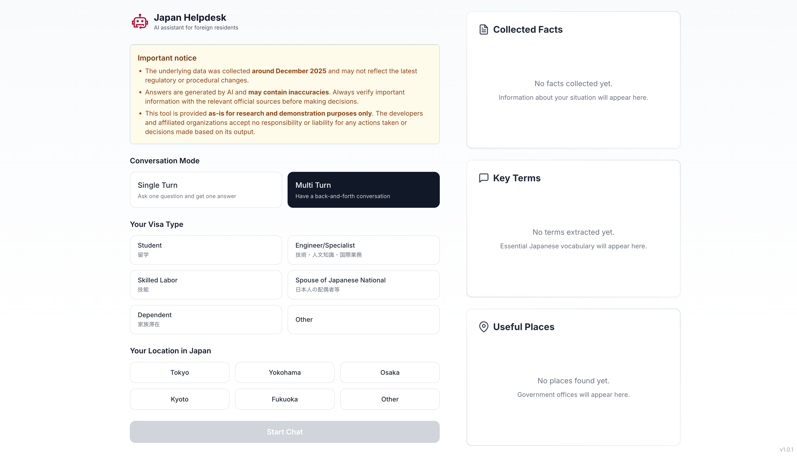
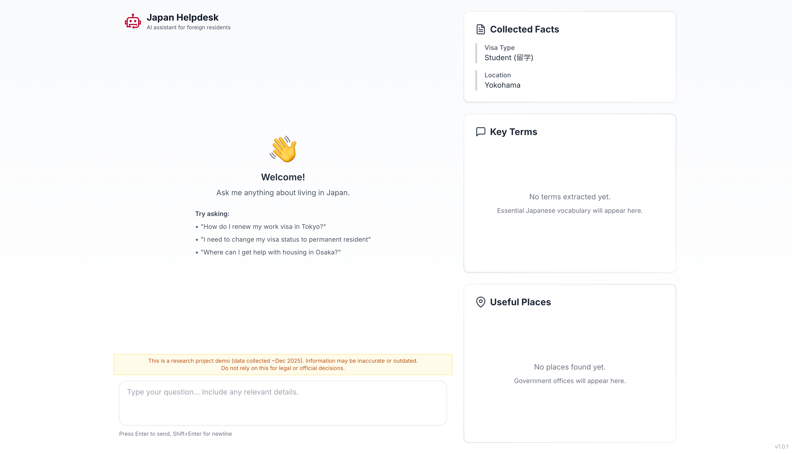
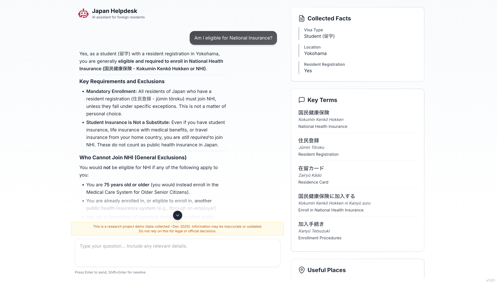
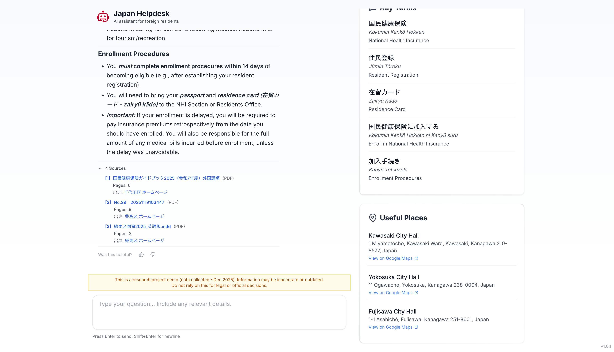
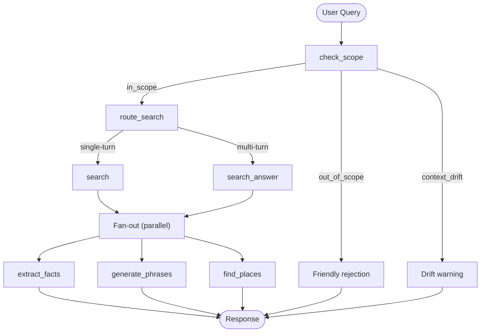

# Japan Helpdesk -- AI Assistant for Foreign Residents

This repository contains the source code for the **Japan Helpdesk**, an AI-powered chatbot that helps foreign residents navigate official procedures in Japan (visas, municipal registration, health insurance, taxes, and more). It was developed as a practical implementation exercise under the **NEDO "AIセーフティ強化に関する研究開発" (P25006)** programme by [Citadel AI](https://www.citadel-ai.com/), serving both as a working demo and as a reference codebase whose development journey is documented in the accompanying best-practices report.

本リポジトリはNEDO「AIセーフティ強化に関する研究開発」の一環として [Citadel AI](https://www.citadel-ai.com/) が開発した外国人支援チャットボット **Japan Helpdesk** のソースコードです。在留外国人がビザ手続き・転入届・健康保険・税金などの行政手続きについて質問できるAIアシスタントであり、同時にベストプラクティス集のための実装事例としても機能しています。

## What It Does

A user selects their visa type and location, then asks questions in a chat interface. The system:

1. **Checks scope** -- rejects off-topic queries and warns on mid-conversation topic drift.
2. **Searches official sources** -- queries a Vertex AI Search data store containing curated government documents, returning grounded answers with inline citations.
3. **Enriches the response** -- three parallel "info agents" extract user facts, generate relevant Japanese vocabulary, and find nearby government offices via Google Maps.

The frontend displays the answer alongside collapsible source citations, a collected-facts sidebar, key Japanese terms, and clickable map links.

## Screenshots

| Setup | Chat |
|:---:|:---:|
|  |  |

| Answer with enrichments | Sources & nearby places |
|:---:|:---:|
|  |  |

## Architecture



The backend is a **LangGraph** `StateGraph` compiled with an in-memory checkpointer. Each box above is a node; conditional edges handle routing. The frontend is a React + Vite SPA that talks to a FastAPI server.

## Tech Stack

| Layer | Technology |
|-------|-----------|
| Agent framework | LangGraph (explicit graph-based workflows) |
| LLM | Gemini 2.5 Flash / Pro via Vertex AI |
| RAG | Vertex AI Search (managed data store of government documents) |
| Maps | Vertex AI with Google Maps grounding |
| Backend | FastAPI, uvicorn |
| Frontend | React 19, Vite, Tailwind CSS |
| Observability | Langfuse v3 (session tracking, user feedback scoring) |
| Deployment | Docker, Google Cloud Run |

## Getting Started

### Prerequisites

- Python >= 3.11
- Node.js >= 18
- A Google Cloud project with Vertex AI Search configured
- `gcloud auth application-default login` completed

### 1. Environment

```bash
cp env_template.txt .env
# Edit .env with your GCP project, data store ID, and engine ID
```

### 2. Install dependencies

```bash
# Python (recommended: uv for speed)
uv venv && source .venv/bin/activate && uv pip install -e ".[dev]"

# Frontend
cd frontend && npm install && cd ..
```

### 3. Run

```bash
./start.sh          # starts backend (port 8000) + frontend (port 3000)
# open http://localhost:3000

./stop.sh            # tears down both processes
```

Or run manually in two terminals:

```bash
# Terminal 1
source .venv/bin/activate && python run_server.py

# Terminal 2
cd frontend && npm run dev
```

## Environment Variables

### Required

| Variable | Description |
|----------|-------------|
| `GOOGLE_CLOUD_PROJECT` | GCP project ID |
| `VERTEX_AI_SEARCH_DATA_STORE_ID` | Vertex AI Search data store resource ID |
| `VERTEX_AI_SEARCH_ENGINE_ID` | Vertex AI Search engine (app) ID |

### Optional

| Variable | Default | Description |
|----------|---------|-------------|
| `LANGFUSE_ENABLED` | `false` | Enable Langfuse tracing |
| `LANGFUSE_PUBLIC_KEY` | -- | Langfuse public key |
| `LANGFUSE_SECRET_KEY` | -- | Langfuse secret key |
| `LANGFUSE_BASE_URL` | `https://cloud.langfuse.com` | Langfuse host |
| `RATE_LIMIT_QUERY` | `60/minute` | Rate limit for `/api/query` |
| `RATE_LIMIT_CONTEXT` | `30/minute` | Rate limit for `/api/context` |

## Key Design Decisions

These choices are discussed in detail in the accompanying NEDO report (Appendix 2):

- **LangGraph + Cloud Run** was chosen over managed alternatives (LangChain Cloud, Vertex AI Agent Builder) to retain full control over the frontend and deployment, while still using a framework that encodes agent logic as explicit, inspectable graphs.
- **Single-turn vs. multi-turn** mode is selected by the user in the UI. Single-turn uses the Vertex AI Search Summary API (stateless, fast); multi-turn uses the Answer API with server-managed sessions for follow-up context.
- **Context drift detection** warns users when they switch topics mid-conversation, because mixing unrelated queries degrades answer quality and fact tracking.
- **Parallel info agents** (facts, phrases, places) run concurrently after the main search, so the latency cost of enrichment is the slowest agent rather than the sum.
- **Langfuse v3** provides production-grade observability with session-level trace grouping, per-query tagging by visa type and location, and a thumbs-up/down feedback loop that feeds back into evaluation.

## API Reference

| Method | Endpoint | Description |
|--------|----------|-------------|
| `POST` | `/api/context` | Initialise a thread with visa type, location, and mode |
| `POST` | `/api/query` | Send a question and receive an answer with citations |
| `POST` | `/api/feedback` | Submit thumbs-up/down for a response (logged to Langfuse) |
| `GET` | `/api/thread/{id}` | Inspect current thread state |
| `DELETE` | `/api/thread/{id}/facts` | Remove a collected fact |
| `GET` | `/api/health` | Health check |

## Project Structure

```
backend/
  api/server.py          FastAPI endpoints and Pydantic models
  core/graph.py          LangGraph workflow definition
  core/state.py          AgentState (shared conversation state)
  nodes/                 Graph nodes: scope check, search, info agents
  services/              Query orchestration, context management, feedback
  tools/                 Vertex AI Search, Answer, and Google Maps wrappers
  utils/                 Config, logging, Langfuse, citation parsing

frontend/
  src/App.jsx            Main layout (chat + info cards)
  src/components/        Chat, InitialForm, CollectedFacts, Phrases, Places
  src/api.js             Backend API client

docs/                    Detailed design docs (Langfuse, deployment, architecture, etc.)
notebooks/               Vertex AI parameter experiments
```

## Deployment

### Docker

```bash
docker build -t japan-helpdesk .
docker run -p 8080:8080 \
  -e GOOGLE_CLOUD_PROJECT=... \
  -e VERTEX_AI_SEARCH_DATA_STORE_ID=... \
  -e VERTEX_AI_SEARCH_ENGINE_ID=... \
  japan-helpdesk
```

### Google Cloud Run

```bash
./deploy-to-cloud-run.sh
```

See [`docs/deployment-guide.md`](docs/deployment-guide.md) for full instructions. Apple Silicon users: the deploy script handles ARM-to-AMD64 cross-compilation automatically.

## Further Documentation

The `docs/` folder contains detailed write-ups on individual topics:

- [Architecture note](docs/architecture-note.md) -- ARM64 vs AMD64 for Cloud Run
- [Citation extraction](docs/citation-extraction.md) -- how citations are parsed from Vertex responses
- [Deployment guide](docs/deployment-guide.md) -- local, Docker, and Cloud Run deployment
- [Langfuse integration](docs/langfuse-integration.md) -- observability setup and usage
- [LangSmith setup](docs/langsmith-setup.md) -- LangChain tracing and debugging

## Important Notice / ご利用上の注意

- The data was compiled based on information available as of **February 2026** and should be used with the understanding that it may not be up to date. （本データは2026年2月時点の情報を基に作成されており、最新の状況を反映していない可能性があります）
- Users should verify chatbot answers by checking the relevant official websites themselves. （チャットボットの回答内容については、必ず利用者ご自身で関連する公式ホームページをご確認ください）
- There are no plans to update the data. （本データについて、今後更新を行う予定はありません）
- Contacting individual municipalities about information from this tool is strictly prohibited.（本ツールの出力内容に関して、各自治体へ問い合わせることは固く禁止します。）

## Acknowledgements

This project was developed under the **NEDO「AIセーフティ強化に関する研究開発」(P25006)** programme. The accompanying report documents best practices gathered from industry hearings with Japanese enterprises, and uses this codebase as a reference implementation (Appendix 2) to validate those practices in a realistic setting.

この成果は、国立研究開発法人新エネルギー・産業技術総合開発機構(NEDO)の委託業務 (P25006) の結果得られたものです。

## License

This project is licensed under the [MIT License](./LICENSE).
